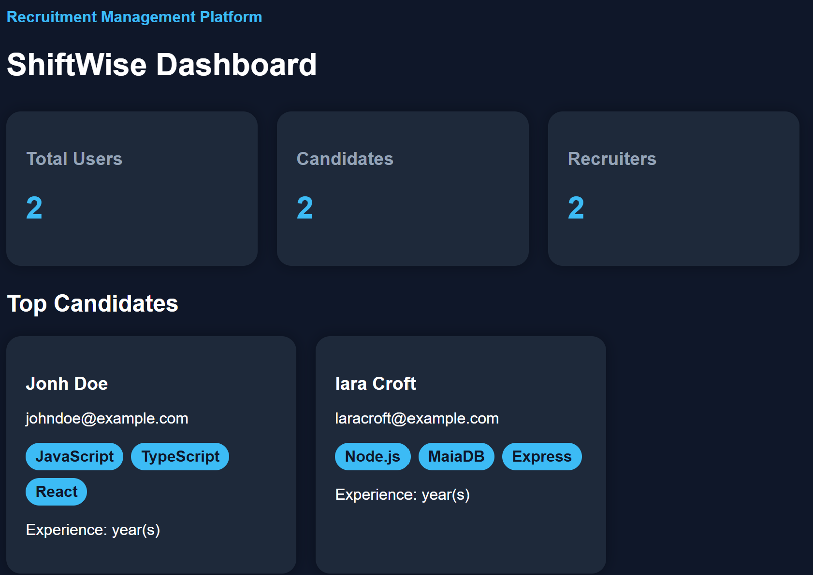
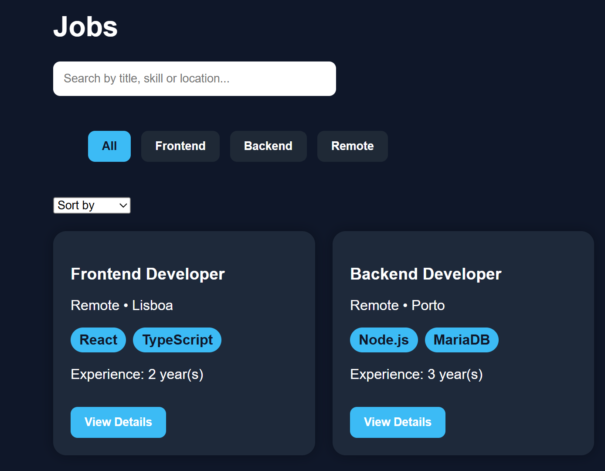
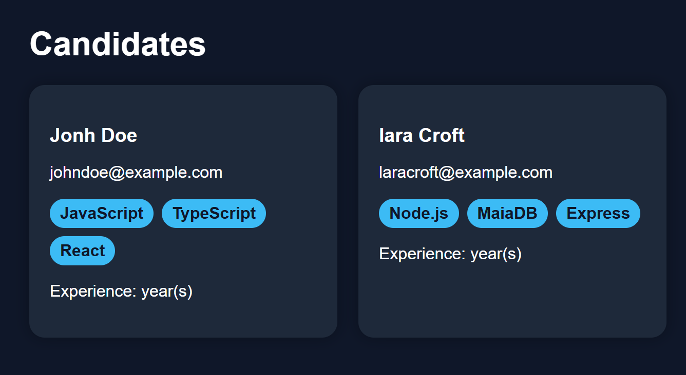
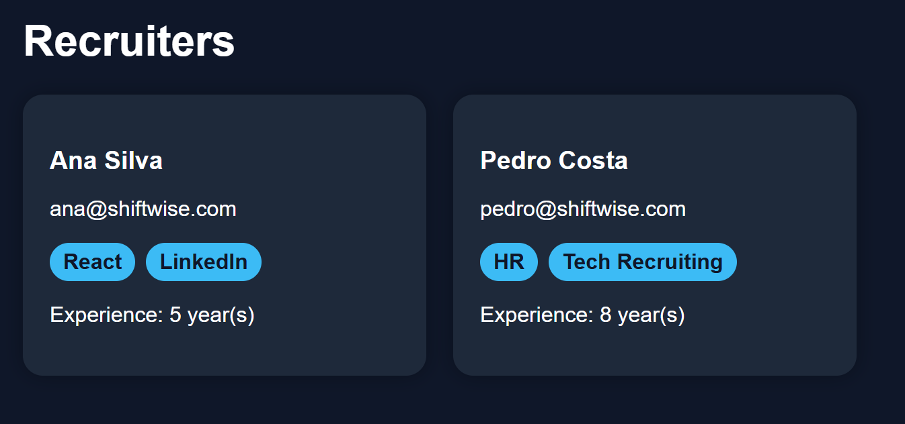
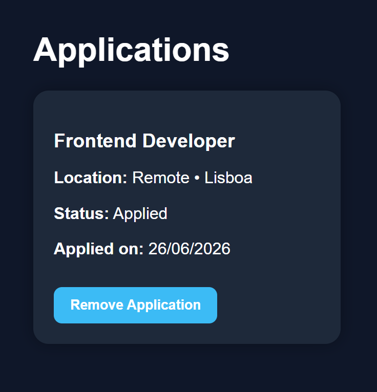

# 🚀 ShiftWise

<p align="center">

# Recruitment Management Platform

A modern recruitment management platform built with **React**, **TypeScript** and **Vite**.


</p>

---

# 📖 About

**ShiftWise** is a recruitment management platform developed as a personal learning project.

The application simulates a modern recruitment system where recruiters can:

* Manage candidates
* Publish job opportunities
* Track applications
* Save favourite jobs
* Search and filter vacancies

The main goal of this project is to improve my **React**, **TypeScript** and **Front-End** development skills while building software following modern development practices.

---

# ✨ Features

* 📊 Dashboard
* 👤 Candidate Management
* 👨‍💼 Recruiter Management
* 💼 Job Listings
* 📄 Job Details
* 🔍 Search Jobs
* 🎯 Filter Jobs
* ↕️ Sort Jobs
* ✅ Apply to Jobs
* ❤️ Save Favourite Jobs
* 💾 LocalStorage Persistence
* 📱 Responsive Design

---

# 🛠️ Technologies

* React
* TypeScript
* Vite
* CSS
* LocalStorage

---

# 📸 Screenshots

## 📊 Dashboard



Overview of the platform with recruitment statistics and quick navigation.

---

## 💼 Job Listings



Browse, search, filter and sort job opportunities.

---

## 📄 Job Details


Detailed information about each vacancy, including required technologies and experience.

---

## 👤 Candidates



Candidate profiles displayed using reusable React components.

---

## 👨‍💼 Recruiters



Recruiter profiles including contact information and technologies.

---

## ✅ Applications



Track submitted applications and monitor their status.

---

## ❤️ Saved Jobs


Save interesting job opportunities locally using LocalStorage.

---

# 📂 Project Structure

```text
frontend/
│
├── src/
│   ├── assets/
│   ├── components/
│   ├── pages/
│   ├── services/
│   ├── styles/
│   └── App.tsx
│
└── public/
```

---

# 🚀 Getting Started

Clone the repository

```bash
git clone https://github.com/abr018/ShiftWise.git
```

Navigate to the Frontend

```bash
cd ShiftWise/frontend
```

Install dependencies

```bash
npm install
```

Run the application

```bash
npm run dev
```

---

# 🎯 Roadmap

* 🔐 JWT Authentication
* 🌐 ASP.NET Core Web API
* 🗄️ MariaDB Integration
* 👤 User Profiles
* 👨‍💼 Recruiter Authentication
* 🖼️ Image Upload
* 📧 Email Notifications
* 🐳 Docker Support
* ✅ Unit Testing
* ☁️ Cloud Deployment

---

# 👨‍💻 Author

**José Abreu Cosme Zaza**

🎓 Computer Science Student

💻 Aspiring Full-Stack Developer

GitHub:
https://github.com/abr018

---

<p align="center">

⭐ If you like this project, consider giving it a Star!

</p>
