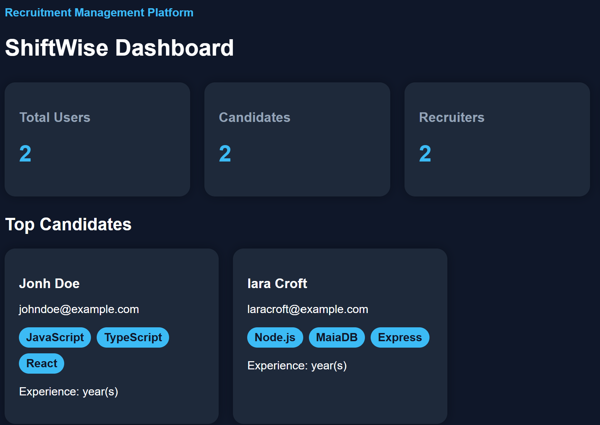
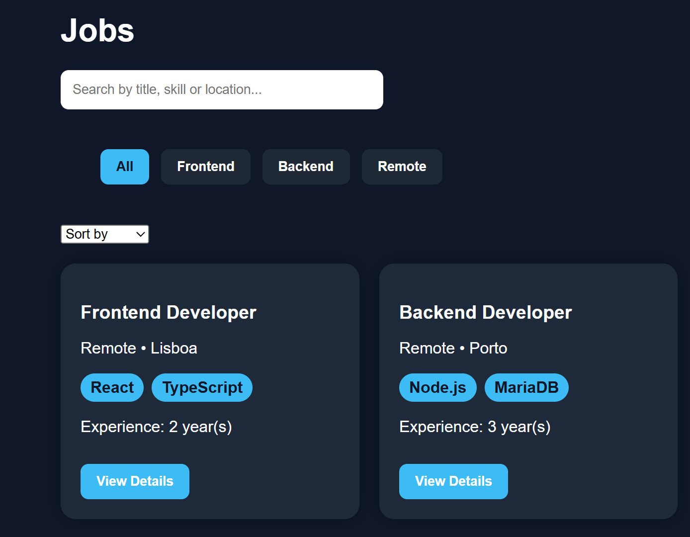
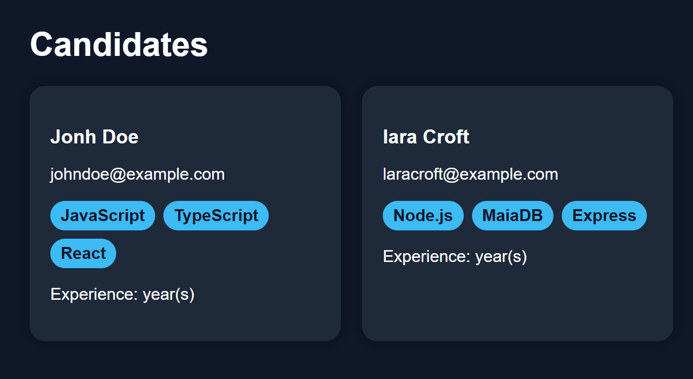
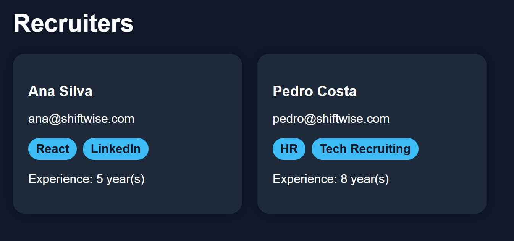
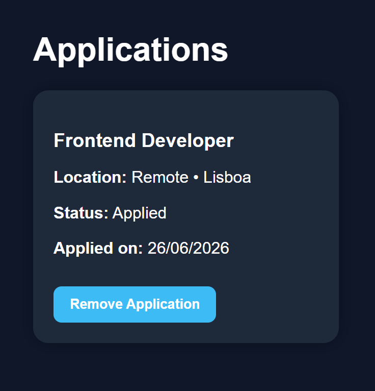

# 🚀 ShiftWise

<p align="center">

# Recruitment Management Platform

A full-stack recruitment management platform built with **React**, **TypeScript**, **Node.js**, **Express**, **Prisma** and **MariaDB**.


</p>

---

# 📖 About

**ShiftWise** is a full-stack recruitment management platform developed as a personal portfolio project.

The application simulates a recruitment system where candidates can explore job opportunities, search and filter vacancies, save jobs and submit applications. It also provides candidate and recruiter information through a REST API connected to a relational database.

The project was created to strengthen my skills in **full-stack development**, **REST APIs**, **database integration**, **React** and **TypeScript**.

---

# ✨ Features

- 📊 Recruitment dashboard
- 👤 Candidate profiles
- 👨‍💼 Recruiter profiles
- 💼 Job listings
- 📄 Job details
- 🔍 Job search
- 🎯 Job filtering
- ↕️ Job sorting
- ✅ Job applications
- ⭐ Saved jobs
- 🔐 Login and session persistence
- 🔌 REST API integration
- 🗄️ Database persistence
- 📱 Responsive interface

---

# 🛠️ Tech Stack

### Frontend
- React
- TypeScript
- Vite
- CSS

### Backend
- Node.js
- Express
- TypeScript
- Prisma ORM

### Database
- MariaDB

---

# 📸 Screenshots

## 📊 Dashboard

<p align="center">
  
</p>

Overview of the recruitment platform with statistics and quick navigation.

---

## 💼 Job Listings

<p align="center">
  
</p>

Browse, search, filter and sort available job opportunities.

---

## 📄 Job Details

<p align="center">
  
</p>

View vacancy information, required technologies and experience.

---

## 👤 Candidates

<p align="center">
  
</p>

Candidate information retrieved from the backend API.

---

## 👨‍💼 Recruiters

<p align="center">
  
</p>

Recruiter profiles retrieved from the backend API.

---

## ✅ Applications

<p align="center">
  
</p>

Track submitted job applications and their current status.

---

## ⭐ Saved Jobs

<p align="center">
  
</p>

Save and remove job opportunities from the saved jobs section.

---

# 📂 Project Structure

```text
ShiftWise/
│
├── backend/
│   ├── prisma/
│   └── src/
│       ├── controllers/
│       ├── routes/
│       ├── services/
│       └── server.ts
│
├── frontend/
│   ├── public/
│   └── src/
│       ├── assets/
│       ├── components/
│       ├── pages/
│       ├── services/
│       ├── styles/
│       └── App.tsx
│
└── screenshots/
```

---

# 🚀 Getting Started

## Clone the repository

```bash
git clone https://github.com/abr018/ShiftWise.git
cd ShiftWise
```

## Backend

```bash
cd backend
npm install
npm run dev
```

## Frontend

Open another terminal:

```bash
cd frontend
npm install
npm run dev
```

The frontend will be available through the local Vite development server.

> The backend requires a configured MariaDB database and environment variables.

---

# 🔮 Future Improvements

- Role-based authentication and authorization
- Improved user profiles
- Recruiter job management
- Email notifications
- Automated testing
- Docker support
- Cloud deployment

---

# 👨‍💻 Author

**José Abreu Cosme Zaza**

🎓 Computer Science Student  
💻 Junior Full-Stack Developer

GitHub: https://github.com/abr018

---

<p align="center">
⭐ If you found this project interesting, consider giving it a star!
</p>